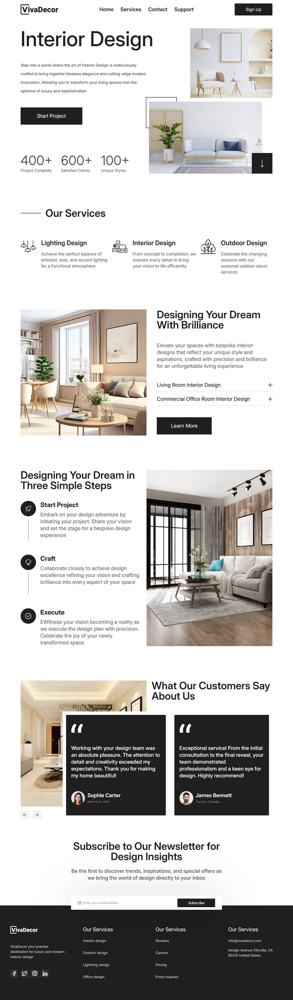

# VivaDecor Landing Page

A modern, responsive landing page for BiteHub, crafted using **Semantic HTML**, **Tailwind CSS**, and **JavaScript**. Built with a **mobile-first workflow**, ensuring a seamless experience across all devices.

## 📸 Screenshots



## 🚀 Live Preview

Check out the live version here: [VivaDecor Live]()

## 📌 Features

- Fully **responsive** design
- Built with **Semantic HTML** for accessibility
- Styled with **Tailwind CSS** for quick and efficient UI design
- **JavaScript** enhancements for interactivity
- Optimized for **mobile-first** experience

## 🛠️ Technologies Used

- **HTML5** (Semantic Structure)
- **Tailwind CSS** (Utility-First Styling)
- **JavaScript** (Interactive Elements)

## 📂 Folder Structure

```
interior-landing-page/
    ├── assets/
    │   ├── img
    │   ├── css/
    │   │   ├── input.css
    │   │   └── output.css
    │   └── js/
    │       └── main.js
    ├── index.html
    ├── .gitignore
    ├── tailwind.config.js
    ├── README.md
    └── package.json
```

## 📌 Installation & Usage

1- Clone the repository:

   ```sh
   git clone https://github.com/yourusername/bitehub-landing.git
   ```

2- Navigate to the project directory:

   ```sh
   cd interior-landing-page
   ```

3- Open `index.html` in your browser.

## 👨‍💻 Author

[](https://www.linkedin.com/in/muhammad-hisham-23544b253/)
[](mailto:muhammedheshamm2@gmail.com)
[](https://muhammadhisham2024.netlify.app/)
